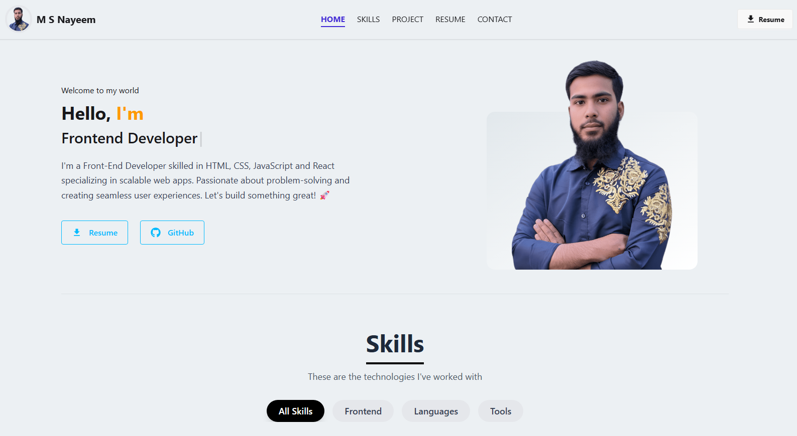

# Hi, I'm M S Nayeem, a Front-End Developer specializing in React.js.

*(Image: A screenshot of the Nayeem-Portfolio website's main page)*

## About Me

I am **M S Nayeem**, a passionate and dedicated **Front-End React Developer** with a strong focus on building responsive, user-friendly, and performant web applications. With a solid foundation in modern web technologies, I strive to create engaging digital experiences that are both visually appealing and highly functional.

This repository hosts my personal portfolio website, showcasing a collection of my projects, skills, and experience.

## Live Demo

Explore my work live:
**[https://msnayeem.netlify.app/](https://msnayeem.netlify.app/)**

## Features

*   **Responsive Design:** Optimized for various devices and screen sizes.
*   **Modern UI/UX:** Clean, intuitive, and engaging user interface.
*   **Project Showcase:** Detailed presentation of my key projects with descriptions and links.
*   **Skills Overview:** A comprehensive list of my technical proficiencies.
*   **Contact Form:** Easy way for recruiters and collaborators to reach out.
*   **Interactive Elements:** Dynamic components built with React.

## Technologies Used

*   **Frontend:**
    *   React.js
    *   JavaScript (ES6+)
    *   HTML5
    *   CSS3 (Tailwind CSS for utility-first styling)
*   **Build Tools:**
    *   Vite (for fast development server and optimized builds)
*   **Version Control:**
    *   Git

## Contact

Feel free to connect with me!

*   **Email:** msnayeem333@gmail.com
*   **LinkedIn:** [https://www.linkedin.com/in/m-s-nayeem/](https://www.linkedin.com/in/m-s-nayeem/) 
*   **GitHub:** [https://github.com/NayeemWD](https://github.com/NayeemWD)
*   **Phone:** +88 01643-547750

---
_This README was generated with ❤️ by a Gemini AI Agent_