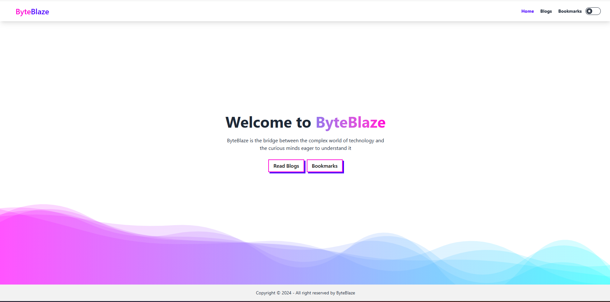

# Nayeem-Portfolio


*(Image: A screenshot of the Nayeem-Portfolio website's main page)*

## About Me

I am **M S Nayeem**, a passionate and dedicated **Front-End React Developer** with a strong focus on building responsive, user-friendly, and performant web applications. With a solid foundation in modern web technologies, I strive to create engaging digital experiences that are both visually appealing and highly functional.

This repository hosts my personal portfolio website, showcasing a collection of my projects, skills, and experience.

## Live Demo

Explore my work live:
**[https://msnayeem.netlify.app/](https://msnayeem.netlify.app/)**

## Features

*   **Responsive Design:** Optimized for various devices and screen sizes.
*   **Modern UI/UX:** Clean, intuitive, and engaging user interface.
*   **Project Showcase:** Detailed presentation of my key projects with descriptions and links.
*   **Skills Overview:** A comprehensive list of my technical proficiencies.
*   **Contact Form:** Easy way for recruiters and collaborators to reach out.
*   **Interactive Elements:** Dynamic components built with React.

## Technologies Used

*   **Frontend:**
    *   React.js
    *   JavaScript (ES6+)
    *   HTML5
    *   CSS3 (Tailwind CSS for utility-first styling)
*   **Build Tools:**
    *   Vite (for fast development server and optimized builds)
*   **Version Control:**
    *   Git

## Getting Started

To get a local copy up and running, follow these simple steps.

### Prerequisites

*   npm (Node Package Manager)
    ```bash
    npm install npm@latest -g
    ```

### Installation

1.  Clone the repo:
    ```bash
    git clone https://github.com/your-username/Nayeem-Portfolio.git
    ```
    *(Note: Replace `your-username` with your actual GitHub username if this project is hosted there.)*
2.  Navigate into the project directory:
    ```bash
    cd Nayeem-Portfolio
    ```
3.  Install NPM packages:
    ```bash
    npm install
    ```
4.  Run the development server:
    ```bash
    npm run dev
    ```
    The application will typically be accessible at `http://localhost:5173/` (or another port if 5173 is in use).

## Contact

Feel free to connect with me!

*   **Email:** [your-email@example.com](mailto:your-email@example.com) *(Please replace with your actual email address)*
*   **LinkedIn:** [Your LinkedIn Profile URL](https://www.linkedin.com/in/msnayeem/) *(Please replace with your actual LinkedIn profile URL)*
*   **GitHub:** [github.com/your-username](https://github.com/msnayeem/) *(Please replace with your actual GitHub profile URL)*

## License

Distributed under the MIT License. See `LICENSE` for more information. *(Note: If you have a LICENSE file, otherwise this section can be removed or adjusted.)*

---
_This README was generated with ❤️ by a Gemini AI Agent_